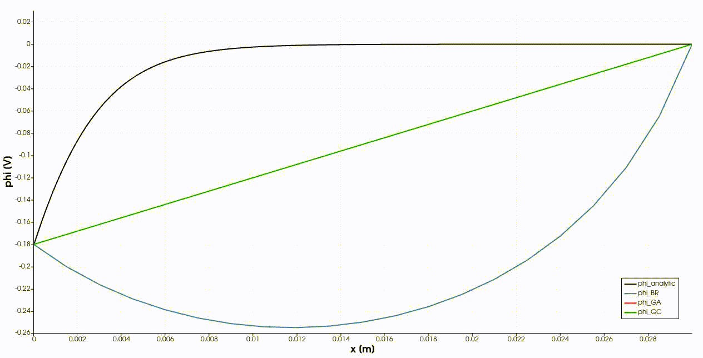

Particle in Cell Method, written in C++

# Installation

You will need a C++ compiler, for example [gcc](https://gcc.gnu.org/), as well as the [Eigen](http://eigen.tuxfamily.org/index.php?title=Main_Page) library installed on your system. Make sure that the directory `/usr/include/Eigen` exists on your system, if not you can create a symlink to where Eigen was installed, usually it is `/usr/include/eigen3`
```
ln -s /usr/include/eigen3 /usr/include/Eigen
```
Now you are all set, just run `make` in the root directory and the code should compile. With `make run` you can run a test case from the `tests` directory. Check out the `Makefile` to see how to use `libcpic` in your own code.

# Examples

## Free Electrons Moving Around a Cloud of Oxygen Ions (Collisionless)


## Two Oxygen Velocity Distributions Merging (DSMC Bird)


## Electron-Electron Relaxation Coulomb Collisions (DSMC Nanbu)


## Plasma Sheath, Comparison between Fully Kinetic vs. Boltzmann-Electron Model

- `phi_analytic` is the analytic solution
- `phi_BR` is the Boltzmann-electron model solution
- `phi_GA` is the fully kinetic solution using Garcia's infolow boundary condition
- `phi_GC` is the fully kinetic solution using the ghost cell inflow boundary condition



## Periodic Boundary Conditions with the Boltzmann-Electron Model


## Xenon Ions being Accelerated by an Ion-Optic


